# Design Document: Blog UI Redesign

## Overview

本设计文档详细描述了博客客户端UI重构的技术架构和实现方案。设计目标是创建一个融合网络安全红队风格、玻璃态美学和动态效果的现代化博客界面，同时保持简约和高性能。

### 设计理念

- **Cyber Glassmorphism**: 结合玻璃态设计与网络安全美学
- **Motion-Driven**: 动态效果驱动的用户体验
- **Trust & Authority**: 专业感和权威感的视觉传达
- **Minimal Complexity**: 视觉炫技但交互简约

## Architecture

### 整体架构图

```mermaid
graph TB
    subgraph "Design System Layer"
        DS[Design Tokens]
        DS --> Colors[Color Palette]
        DS --> Typography[Typography Scale]
        DS --> Spacing[Spacing Tokens]
        DS --> Shadows[Shadow Tokens]
        DS --> Animation[Animation Tokens]
    end
    
    subgraph "Component Layer"
        BC[Base Components]
        BC --> Glass[Glass Components]
        BC --> Button[Buttons]
        BC --> Input[Inputs]
        BC --> Card[Cards]
        
        LC[Layout Components]
        LC --> Header[Header]
        LC --> Footer[Footer]
        LC --> Container[Page Container]
        
        FC[Feature Components]
        FC --> FeedCard[Feed Card]
        FC --> HashTag[HashTag]
        FC --> Markdown[Markdown Renderer]
    end
    
    subgraph "Animation Layer"
        AE[Animation Engine]
        AE --> PageTrans[Page Transitions]
        AE --> ScrollAnim[Scroll Animations]
        AE --> MicroInt[Micro-interactions]
        AE --> CyberFX[Cyber Effects]
    end
    
    subgraph "Theme Layer"
        TS[Theme System]
        TS --> Light[Light Mode]
        TS --> Dark[Dark Mode]
        TS --> System[System Preference]
    end
    
    DS --> BC
    DS --> LC
    DS --> FC
    AE --> BC
    AE --> LC
    AE --> FC
    TS --> DS
```



### 文件结构

```
client/src/
├── styles/
│   ├── tokens/
│   │   ├── colors.css          # 颜色变量
│   │   ├── typography.css      # 字体变量
│   │   ├── spacing.css         # 间距变量
│   │   ├── shadows.css         # 阴影变量
│   │   └── animations.css      # 动画变量
│   ├── base.css                # 基础样式
│   ├── components.css          # 组件样式
│   └── cyber-effects.css       # 网络安全特效
├── components/
│   ├── ui/                     # 基础UI组件
│   │   ├── glass-panel.tsx
│   │   ├── cyber-button.tsx
│   │   ├── glow-text.tsx
│   │   └── loading-skeleton.tsx
│   ├── layout/                 # 布局组件
│   │   ├── header.tsx
│   │   ├── footer.tsx
│   │   └── page-container.tsx
│   └── features/               # 功能组件
│       ├── feed-card.tsx
│       ├── scroll-progress.tsx
│       └── matrix-rain.tsx
├── hooks/
│   ├── useScrollAnimation.ts
│   ├── useIntersectionObserver.ts
│   └── useReducedMotion.ts
└── utils/
    └── animation-utils.ts
```

## Components and Interfaces

### 1. Design Tokens Interface

```typescript
// types/design-tokens.ts
interface ColorTokens {
  // Primary Cyber Colors
  cyber: {
    green: string;      // #00FF41 - Matrix Green
    greenDark: string;  // #00CC34
    greenLight: string; // #33FF66
  };
  
  // Background Colors
  background: {
    primary: string;    // Light: #F8FAFC, Dark: #0D0D0D
    secondary: string;  // Light: #F1F5F9, Dark: #1F1F1F
    tertiary: string;   // Light: #E2E8F0, Dark: #2D2D2D
  };
  
  // Glass Colors
  glass: {
    light: string;      // rgba(255, 255, 255, 0.1)
    medium: string;     // rgba(255, 255, 255, 0.2)
    strong: string;     // rgba(255, 255, 255, 0.3)
    border: string;     // rgba(255, 255, 255, 0.2)
  };
  
  // Text Colors
  text: {
    primary: string;    // Light: #0F172A, Dark: #F8FAFC
    secondary: string;  // Light: #475569, Dark: #94A3B8
    muted: string;      // Light: #64748B, Dark: #64748B
  };
}

interface AnimationTokens {
  duration: {
    instant: string;    // 0ms
    fast: string;       // 150ms
    normal: string;     // 300ms
    slow: string;       // 500ms
    slower: string;     // 700ms
  };
  easing: {
    default: string;    // cubic-bezier(0.4, 0, 0.2, 1)
    in: string;         // cubic-bezier(0.4, 0, 1, 1)
    out: string;        // cubic-bezier(0, 0, 0.2, 1)
    inOut: string;      // cubic-bezier(0.4, 0, 0.2, 1)
    bounce: string;     // cubic-bezier(0.34, 1.56, 0.64, 1)
  };
}
```

### 2. Glass Panel Component

```typescript
// components/ui/glass-panel.tsx
interface GlassPanelProps {
  children: React.ReactNode;
  intensity?: 'light' | 'medium' | 'strong';
  glow?: boolean;
  glowColor?: string;
  rounded?: 'sm' | 'md' | 'lg' | 'xl' | '2xl';
  className?: string;
  animate?: boolean;
}

// CSS Classes Generated
// .glass-light: backdrop-blur-sm bg-white/10 border border-white/10
// .glass-medium: backdrop-blur-md bg-white/20 border border-white/20
// .glass-strong: backdrop-blur-lg bg-white/30 border border-white/30
// .glass-glow: shadow-[0_0_20px_rgba(0,255,65,0.3)]
```

### 3. Header Component Interface

```typescript
// components/layout/header.tsx
interface HeaderProps {
  children?: React.ReactNode;
}

interface HeaderState {
  isScrolled: boolean;
  isVisible: boolean;
  scrollProgress: number;
}

// Header behavior:
// - Fixed position with glass effect
// - Shrinks on scroll (py-4 -> py-2)
// - Hides on scroll down, shows on scroll up
// - Scroll progress indicator at bottom
```

### 4. Feed Card Component Interface

```typescript
// components/features/feed-card.tsx
interface FeedCardProps {
  id: string;
  title: string;
  summary: string;
  avatar?: string;
  hashtags: { id: number; name: string }[];
  createdAt: Date;
  updatedAt: Date;
  draft?: number;
  listed?: number;
  top?: number;
  index?: number; // For staggered animation
}

// Animation states:
// - Initial: opacity-0, translateY(20px)
// - Visible: opacity-1, translateY(0)
// - Hover: scale(1.02), shadow-glow, border-glow
```

### 5. Animation Hook Interface

```typescript
// hooks/useScrollAnimation.ts
interface UseScrollAnimationOptions {
  threshold?: number;
  rootMargin?: string;
  triggerOnce?: boolean;
}

interface UseScrollAnimationReturn {
  ref: React.RefObject<HTMLElement>;
  isVisible: boolean;
  hasAnimated: boolean;
}

// hooks/useReducedMotion.ts
function useReducedMotion(): boolean;
// Returns true if user prefers reduced motion
```

## Data Models

### Theme Configuration

```typescript
interface ThemeConfig {
  mode: 'light' | 'dark' | 'system';
  colors: ColorTokens;
  animations: {
    enabled: boolean;
    reducedMotion: boolean;
  };
}
```

### Animation Configuration

```typescript
interface AnimationConfig {
  pageTransition: {
    type: 'fade' | 'slide' | 'scale';
    duration: number;
    easing: string;
  };
  scrollReveal: {
    threshold: number;
    staggerDelay: number;
    duration: number;
  };
  hover: {
    scale: number;
    duration: number;
  };
}
```


## Correctness Properties

*A property is a characteristic or behavior that should hold true across all valid executions of a system—essentially, a formal statement about what the system should do. Properties serve as the bridge between human-readable specifications and machine-verifiable correctness guarantees.*

### Property 1: Glass Component Intensity Consistency

*For any* Glass_Component with a specified intensity level (light, medium, strong), the rendered component SHALL have backdrop-filter blur, background opacity, and border opacity values that correspond to the intensity level, where light < medium < strong for all opacity values.

**Validates: Requirements 2.1, 2.2, 2.4**

### Property 2: Animation Reduced Motion Compliance

*For any* animated element in the Blog_System, WHEN the user has prefers-reduced-motion enabled, the element SHALL either have no animation or have animation-duration reduced to 0ms or near-instant values.

**Validates: Requirements 3.4, 13.4**

### Property 3: Staggered Animation Delay Progression

*For any* list of Feed_Card components with indices 0 to n, the animation-delay for card at index i SHALL be greater than the animation-delay for card at index i-1 by approximately 50ms (±10ms tolerance).

**Validates: Requirements 3.5, 7.5**

### Property 4: Feed Card Hover Transform Application

*For any* Feed_Card component, WHEN the component receives a hover event, the computed style SHALL include a scale transform > 1.0 and a box-shadow with the cyber green color (#00FF41) glow effect.

**Validates: Requirements 7.1, 7.2, 7.7**

### Property 5: Theme Mode Style Application

*For any* theme mode (light, dark, system), WHEN the mode is active, all themed components SHALL have color values that match the mode's color palette, AND the mode preference SHALL be persisted in localStorage.

**Validates: Requirements 9.1, 9.3, 9.4**

### Property 6: Color Contrast Accessibility

*For any* text element rendered on a glass background, the contrast ratio between the text color and the effective background color SHALL be at least 4.5:1 for normal text and 3:1 for large text (WCAG AA).

**Validates: Requirements 2.6, 9.6, 13.1**

### Property 7: Responsive Layout Breakpoint Adaptation

*For any* Page_Container component, WHEN the viewport width crosses a breakpoint threshold (640px, 768px, 1024px, 1280px, 1536px), the max-width constraint SHALL change to the appropriate value for that breakpoint.

**Validates: Requirements 8.1, 8.4, 11.3**

### Property 8: Touch Target Minimum Size

*For any* interactive element (button, link, input) in the Blog_System, the computed width and height SHALL both be at least 44px to ensure touch-friendly interaction.

**Validates: Requirements 11.2**

### Property 9: Animation Performance Properties

*For any* animated element in the Blog_System, the animation SHALL only modify transform and/or opacity properties (not layout properties like width, height, top, left) to ensure GPU acceleration.

**Validates: Requirements 11.4, 12.2**

### Property 10: Lazy Loading Implementation

*For any* image element below the initial viewport fold, the element SHALL have loading="lazy" attribute OR be loaded via Intersection Observer to defer loading until near-visible.

**Validates: Requirements 12.1**

### Property 11: Keyboard Navigation Accessibility

*For any* interactive element in the Blog_System, the element SHALL be reachable via Tab key navigation AND have a visible focus indicator when focused.

**Validates: Requirements 13.2, 13.6**

### Property 12: ARIA Label Completeness

*For any* interactive element without visible text content (icon buttons, image links), the element SHALL have an aria-label or aria-labelledby attribute providing accessible name.

**Validates: Requirements 13.3**

### Property 13: Header Scroll Behavior

*For any* scroll position > 100px, the Header_Component SHALL have reduced padding (py-2 instead of py-4) AND increased backdrop-blur intensity.

**Validates: Requirements 5.2, 5.5**

### Property 14: Feed Card Status Indicator Visibility

*For any* Feed_Card with draft=1, listed=0, or top=1 status, the corresponding visual indicator (draft badge, unlisted icon, pinned icon) SHALL be visible in the rendered card.

**Validates: Requirements 7.6**

### Property 15: Interactive Element Hover State

*For any* interactive element (button, link, card) in the Blog_System, WHEN the element receives a hover event, the computed style SHALL differ from the default state (via color change, transform, or shadow).

**Validates: Requirements 10.1, 10.5**

## Error Handling

### Animation Errors

1. **Reduced Motion Fallback**: When animations fail or cause performance issues, the system gracefully degrades to instant state changes
2. **Missing Keyframes**: If animation keyframes are not loaded, elements display in their final state without animation
3. **Browser Compatibility**: For browsers not supporting backdrop-filter, fallback to solid semi-transparent backgrounds

### Theme Errors

1. **localStorage Unavailable**: If localStorage is not available, default to system preference without persistence
2. **Invalid Theme Value**: If stored theme value is invalid, reset to 'system' mode
3. **CSS Variable Fallback**: All CSS variables have fallback values for older browsers

### Component Errors

1. **Image Load Failure**: Display placeholder with cyber-grid pattern if image fails to load
2. **Font Load Failure**: Fallback to system sans-serif fonts
3. **Missing Props**: Components have sensible defaults for all optional props

## Testing Strategy

### Unit Tests

Unit tests will verify specific component behaviors and edge cases:

1. **Glass Component Tests**
   - Verify correct CSS classes for each intensity level
   - Test glow effect toggle
   - Verify rounded corner variants

2. **Theme System Tests**
   - Test mode switching logic
   - Verify localStorage persistence
   - Test system preference detection

3. **Animation Hook Tests**
   - Test useReducedMotion hook returns correct value
   - Test useScrollAnimation visibility detection
   - Test stagger delay calculation

### Property-Based Tests

Property-based tests will use a testing library (e.g., fast-check with Vitest) to verify universal properties:

1. **Configuration**: Minimum 100 iterations per property test
2. **Tagging**: Each test tagged with **Feature: blog-ui-redesign, Property N: {property_text}**
3. **Generators**: Custom generators for:
   - Glass intensity levels
   - Theme modes
   - Viewport sizes
   - Feed card data

### Integration Tests

1. **Page Navigation**: Verify page transitions work correctly
2. **Theme Persistence**: Verify theme survives page reload
3. **Responsive Behavior**: Verify layout at all breakpoints

### Accessibility Tests

1. **Contrast Ratio**: Automated contrast checking for all text/background combinations
2. **Keyboard Navigation**: Tab through all interactive elements
3. **Screen Reader**: Verify ARIA labels are announced correctly

### Visual Regression Tests

1. **Component Snapshots**: Capture visual state of all components
2. **Theme Comparison**: Compare light/dark mode renders
3. **Responsive Snapshots**: Capture at each breakpoint
